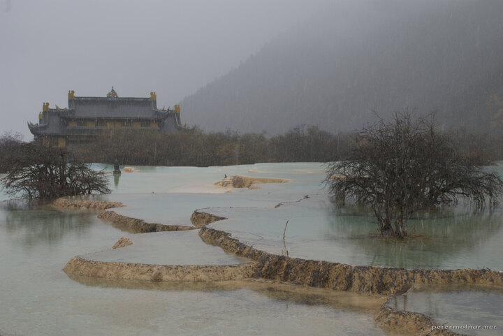

---
author:
    email: mail@petermolnar.net
    image: https://petermolnar.net/favicon.jpg
    name: Peter Molnar
    url: https://petermolnar.net
coordinates:
    latitude: 32.747579
    longitude: 103.834147
copies:
- https://www.flickr.com/photos/36003160@N08/15688903187
- http://web.archive.org/web/20141207104059/https://petermolnar.eu/photo/huanglong-ancient-temple-view/
published: '2014-10-27T04:18:22+00:00'
syndicate:
- https://brid.gy/publish/flickr
tags:
- temple
- Sichuan
- tibetian buddhist
- Huanglong
- gloomy
- autumn
- mist
- rain
- buddhism
- China
- shrine
title: Huanglong - a view of the ancient temple

---

The hundreds of years old Huanglong Ancient Temple from the shore of the
Multi-Coloured Ponds in a bit of a snow.

Even though this is not the weather you wish for at a visit to a natural
phenomenon it certainly has it's own magic when you see these places in
a misty, gloomy weather.