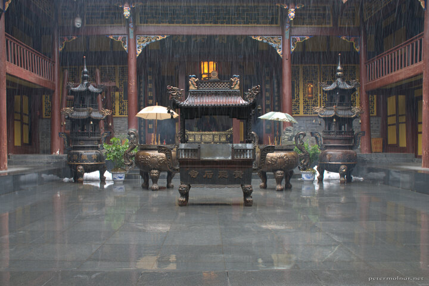

---
author:
    email: mail@petermolnar.net
    image: https://petermolnar.net/favicon.jpg
    name: Peter Molnar
    url: https://petermolnar.net
coordinates:
    latitude: 32.7475070001278
    longitude: 103.834061
copies:
- https://www.flickr.com/photos/36003160@N08/15881661432
- http://web.archive.org/web/20141207145542/https://petermolnar.eu/photo/huanglong-ancient-temple/
published: '2014-11-26T09:00:01+00:00'
syndicate:
- https://brid.gy/publish/flickr
tags:
- temple
- Sichuan
- tibetian buddhist
- Huanglong
- autumn
- rain
- buddhism
- China
- shrine
title: Huanglong Ancient Temple

---

The day we visited Huanglong Valley at first we got snowing. Since we
started at \~3800m it's not that surprising that later it turned into
sleet and rain. This is how Huanglong Ancient Temple ( 黃龍古寺 ) looks
on the inside when it's raining.