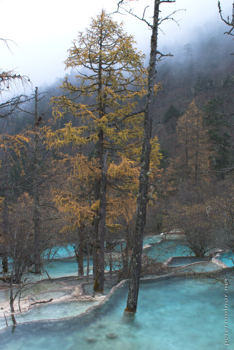

---
author:
    email: mail@petermolnar.net
    image: https://petermolnar.net/favicon.jpg
    name: Peter Molnar
    url: https://petermolnar.net
coordinates:
    latitude: 32.751766
    longitude: 103.828525
copies:
- https://www.flickr.com/photos/36003160@N08/15237894273
- http://web.archive.org/web/20141206194534/https://petermolnar.eu/photo/huanglong-autumn/
published: '2014-10-27T05:51:17+00:00'
syndicate:
- https://brid.gy/publish/flickr
tags:
- Sichuan
- pond
- Huanglong
- autumn
- fir
- China
title: Autumn in Huanglong

---

A view somewhere near the Bonsai Pond in Huanglong (黄龙), with a
not-too-bonsai size, autumn colour fir and the unbelievably blue pond
it's growing out from.