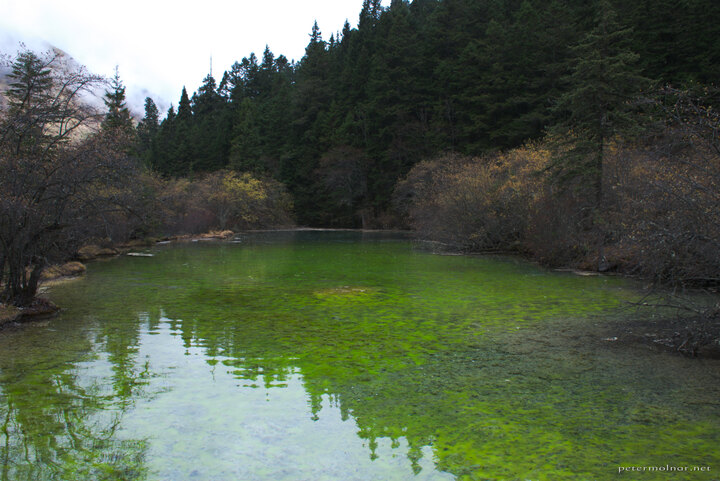

---
author:
    email: mail@petermolnar.net
    image: https://petermolnar.net/favicon.jpg
    name: Peter Molnar
    url: https://petermolnar.net
coordinates:
    latitude: 32.744546999925
    longitude: 103.829727
copies:
- https://www.flickr.com/photos/36003160@N08/15679378980
- http://web.archive.org/web/20141207011436/https://petermolnar.eu/photo/huanglong-jade-green-pond/
published: '2014-10-27T06:49:17+00:00'
syndicate:
- https://brid.gy/publish/flickr
tags:
- Sichuan
- pond
- Huanglong
- green
- autumn
- jade
- China
title: 'Huanglong: Jade green pond'

---

Jade green pond in Huanglong (黄龙). I never really believe these
colours exist without any alteration to the pictures, but they are real.
Huanglong is one of a kind with it's fairytale ponds.