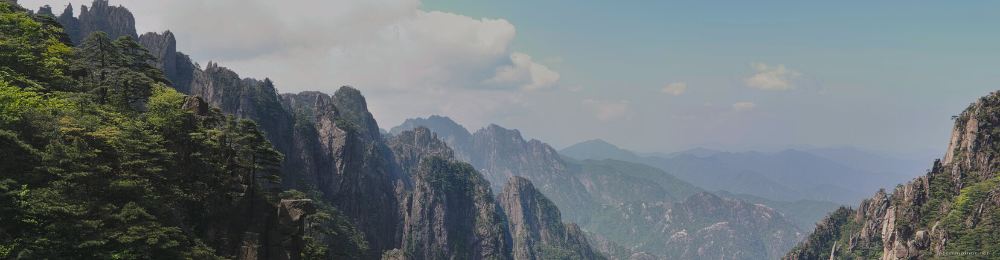

---
author:
    email: mail@petermolnar.net
    image: https://petermolnar.net/favicon.jpg
    name: Peter Molnar
    url: https://petermolnar.net
copies:
- https://www.flickr.com/photos/petermolnareu/48605341027/
- http://web.archive.org/web/20190827150901/https://petermolnar.net/huangshan-panorama-1/
published: '2019-08-23T09:00:00+01:00'
syndicate:
- https://brid.gy/publish/flickr
tags:
- China
- People's Republic of China
- Yellow Mountains
- Huang Shan
- Huangshan
title: Huangshan Panorama 1

---

Huangshan is a unique place. It's also vast, surprisingly long to walk,
and even after the Golden Week it's still packed with people. Regardless
of that it's beautiful.