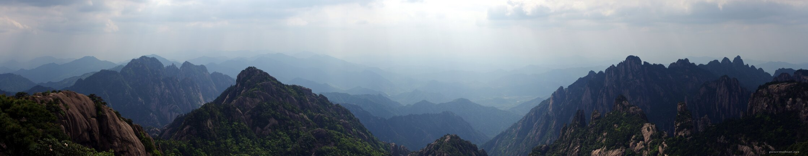

---
author:
    email: mail@petermolnar.net
    image: https://petermolnar.net/favicon.jpg
    name: Peter Molnar
    url: https://petermolnar.net
copies:
- https://www.flickr.com/photos/petermolnareu/48625924738/
- http://web.archive.org/web/20190827150907/https://petermolnar.net/huangshan-panorama-2/
published: '2019-08-26T21:00:00+01:00'
syndicate:
- https://brid.gy/publish/flickr
tags:
- China
- People's Republic of China
- Yellow Mountains
- Huang Shan
- Huangshan
title: Huangshan Panorama 2

---

It's nearly impossible to properly capture landscape with "deep shadows
and brilliant highlights", but I tried to do my best. Non-HDR, multi
picture panorama put together with Huggin.