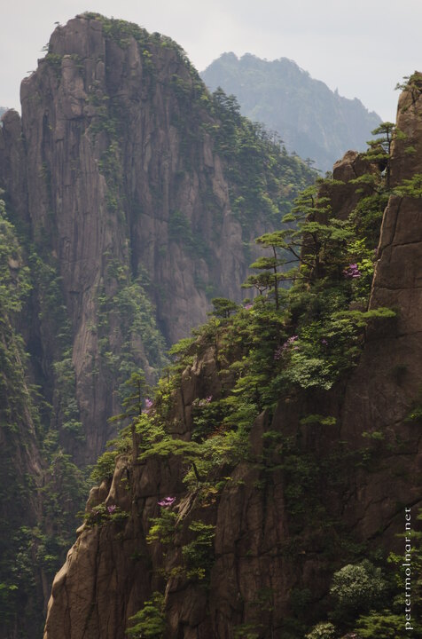

---
author:
    email: mail@petermolnar.net
    image: https://petermolnar.net/favicon.jpg
    name: Peter Molnar
    url: https://petermolnar.net
copies:
- https://www.flickr.com/photos/petermolnareu/48640801951/
- http://web.archive.org/web/20190830231444/https://petermolnar.net/huangshan-scenery-3/
published: '2019-08-29T09:00:00+01:00'
syndicate:
- https://brid.gy/publish/flickr
tags:
- China
- People's Republic of China
- Yellow Mountains
- Huang Shan
- Huangshan
title: Huangshan scenery 3

---

These mountains with the flowers and the spectacular pines are worthy of
being the topic of so many chinese landscape paintings.