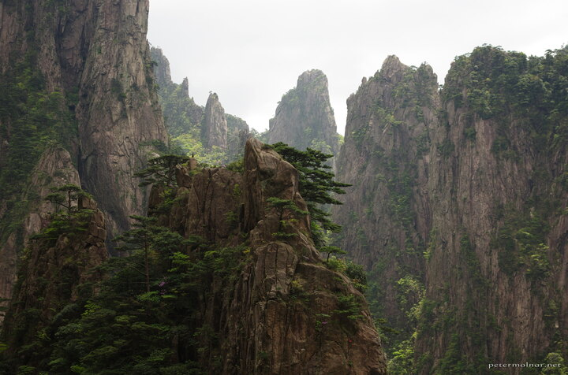

---
author:
    email: mail@petermolnar.net
    image: https://petermolnar.net/favicon.jpg
    name: Peter Molnar
    url: https://petermolnar.net
copies:
- https://www.flickr.com/photos/petermolnareu/48650270902/
- http://web.archive.org/web/20190831093926/https://petermolnar.net/huangshan-scenery-4/
published: '2019-08-30T09:00:00+01:00'
syndicate:
- https://brid.gy/publish/flickr
tags:
- China
- People's Republic of China
- Yellow Mountains
- Huang Shan
- Huangshan
title: Huangshan scenery 4

---

The deeper you go into the rear valley, the wilder, the more alien the
landscape becomes in Huangshan.