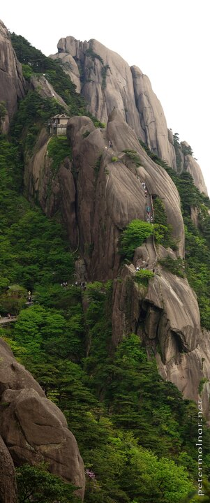

---
author:
    email: mail@petermolnar.net
    image: https://petermolnar.net/favicon.jpg
    name: Peter Molnar
    url: https://petermolnar.net
copies:
- https://www.flickr.com/photos/petermolnareu/48652224906/
- http://web.archive.org/web/20190901200316/https://petermolnar.net/huangshan-stairs-and-tourists/
published: '2019-08-31T09:00:00+01:00'
syndicate:
- https://brid.gy/publish/flickr
tags:
- China
- People's Republic of China
- Yellow Mountains
- Huang Shan
- Huangshan
- tourists
- stairs
title: Huangshan - stairs and tourists

---

Our 2019 visit to China was the first time ever that even with patient
waiting it was impossible to get a view of the scenery without people.
So I kept the people. At least they make the steepness of Huangshan is
visible.