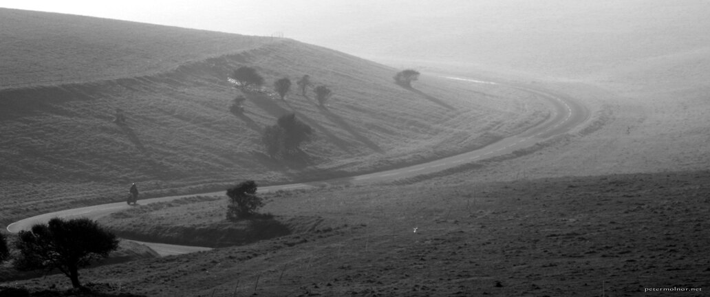

---
author:
    email: mail@petermolnar.net
    image: https://petermolnar.net/favicon.jpg
    name: Peter Molnar
    url: https://petermolnar.net
coordinates:
    latitude: 50.741783
    longitude: 0.253171
copies:
- https://www.flickr.com/photos/36003160@N08/17325968266
- http://web.archive.org/web/20190624125645/https://petermolnar.net/into-the-sunset/
published: '2015-05-03T08:54:40+00:00'
syndicate:
- https://brid.gy/publish/flickr
tags:
- England
- movie
- wide
- road
- sunset
- black and white
- biker
- Beachy Head
- old
- curve
title: Into the sunset

---

Also a shoot from Beachy Head; when the sunset is upon the shore the
road gets more and more empty. I've spotted the biker going the
direction of the curved road, so I waited till the point I could make
this picture.

The reason for the cut is that I wanted the feeling of some old,
forgotten movie.

Lens: Jupiter 11 135mm f4.0 silver m42 version