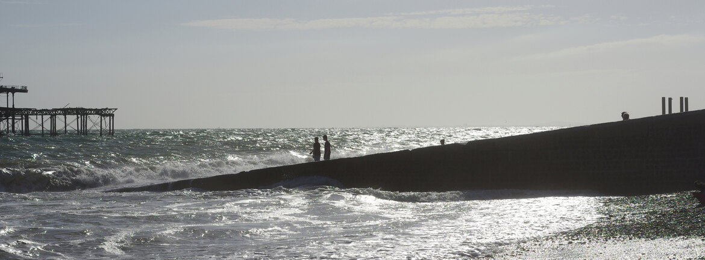

---
author:
    email: mail@petermolnar.net
    image: https://petermolnar.net/favicon.jpg
    name: Peter Molnar
    url: https://petermolnar.net
coordinates:
    latitude: 50.820641
    longitude: -0.149522
copies:
- https://www.flickr.com/photos/36003160@N08/24126958051
- http://web.archive.org/web/20160927070244/https://petermolnar.eu/into-the-white/
published: '2016-01-06T12:31:24+00:00'
syndicate:
- https://brid.gy/publish/flickr
tags:
- pier
- summer
- sunset
- sun
- wave
- Brighton
- sea
- sky
title: into the white

---

There was a stormy wind when I took this picture and I was walking for
about 10 minutes before finally taking it; holding my breath that the
two guys in the pier stay where they are until I reach the perfect
angle.