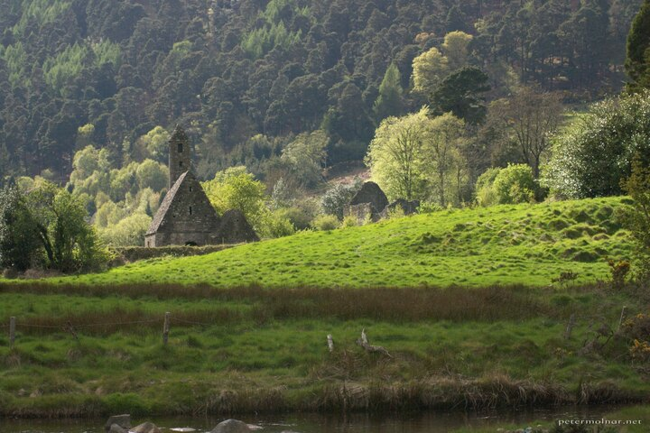

---
author:
    email: mail@petermolnar.net
    image: https://petermolnar.net/favicon.jpg
    name: Peter Molnar
    url: https://petermolnar.net
coordinates:
    latitude: 53.010558
    longitude: -6.327255
copies:
- https://www.flickr.com/photos/36003160@N08/14726542132
- http://web.archive.org/web/20190624125647/https://petermolnar.net/ireland-kevins-kitchen/
published: '2013-05-17T18:00:00+00:00'
syndicate:
- https://brid.gy/publish/flickr
tags:
- church
- Wicklow Mountains
- lights
- Ireland
- Glendalough
- Kevin's Kitchen
title: Ireland - Kevin's Kitchen

---

Kevin's Kitchen, ruins dating back to the 12th century.

This is not HDR; the lights are actully like this in Ireland most of the
time.

We were just about to leave the magnificent Wicklow Mountains behind;
the bus was about to leave in 10 minutes. I was quite sad that the
lights never showed the image I saw when we arrived - and which I did
not photograph - until the very last moment. I ran back to the little
bridge crossing the river there and took a few pictures without any time
to think about the settings. Luckily it resulted in this photo.