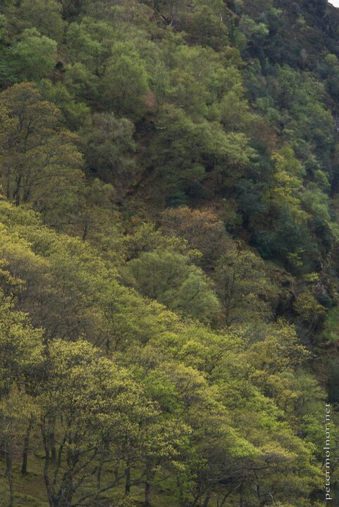

---
author:
    email: mail@petermolnar.net
    image: https://petermolnar.net/favicon.jpg
    name: Peter Molnar
    url: https://petermolnar.net
coordinates:
    latitude: 53.010238
    longitude: -6.369838
copies:
- https://www.flickr.com/photos/36003160@N08/14726552162
- http://web.archive.org/web/20190624125649/https://petermolnar.net/ireland-spring-wicklow/
published: '2013-05-17T18:05:00+00:00'
syndicate:
- https://brid.gy/publish/flickr
tags:
- spring
- forest
- Wicklow Mountains
- colors
- wood
- Ireland
- colours
- Glendalough
title: Ireland - Spring Wicklow

---

During our few days in Ireland we visited the Wicklow Mountains.
Unfortunately there is one single bus to the place which does not leave
early and our time was very limited; if you can, go by car.

These very taken in May, so the colours are the spring colours of the
forest.