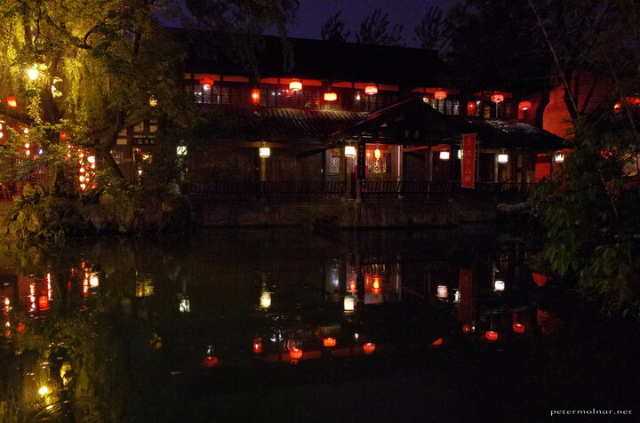

---
author:
    email: mail@petermolnar.net
    image: https://petermolnar.net/favicon.jpg
    name: Peter Molnar
    url: https://petermolnar.net
coordinates:
    latitude: 30.647536
    longitude: 104.048695
copies:
- https://www.flickr.com/photos/36003160@N08/26224475614
- http://web.archive.org/web/20160709135011/https://petermolnar.eu/jinli-street-at-night-1/
published: '2016-04-13T22:19:34+00:00'
syndicate:
- https://brid.gy/publish/flickr
tags:
- lampions
- People's Republic of China
- Chengdu
- Spirited Away
- Sichuan
- abandoned
- night
- China
- ancient china
- street
title: Jinli Street at night 1

---

Jinli Street in Chengdu - this is how a shopping mall could have been
2000 years ago. If you decide to visit this place, go late, on a
weekday, preferably afte rain; otherwise it's packed with hordes of
tourists and locals.