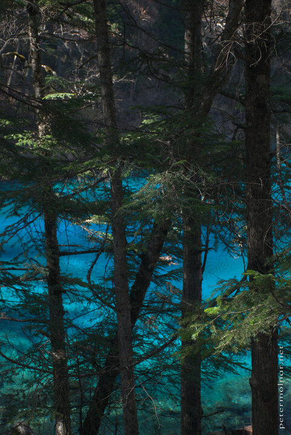

---
author:
    email: mail@petermolnar.net
    image: https://petermolnar.net/favicon.jpg
    name: Peter Molnar
    url: https://petermolnar.net
coordinates:
    latitude: 33.048574
    longitude: 103.930889
copies:
- https://www.flickr.com/photos/36003160@N08/15600959910
- http://web.archive.org/web/20141204005755/https://petermolnar.eu/photo/jiuzhaigou-colours-five-coloured-pool/
published: '2014-10-26T07:20:27+00:00'
syndicate:
- https://brid.gy/publish/flickr
tags:
- Five Coloured Pool
- Sichuan
- autumn
- lake
- Jiuzhaigou Valley
- China
title: 'Jiuzhaigou: The Five Coloured Pool'

---

The Five Coloured Pool in Jiuzhaigou Valley (九寨沟) is the biggest
attraction. It's a small lake with 5 different tones of rich blue, a
blue which is very, very rare. The crowd is pretty bad around the lake,
especially in the middle of the day, so brace yourselves before
arriving.