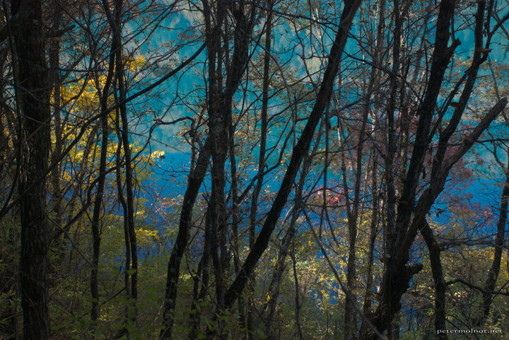

---
author:
    email: mail@petermolnar.net
    image: https://petermolnar.net/favicon.jpg
    name: Peter Molnar
    url: https://petermolnar.net
coordinates:
    latitude: 33.184793
    longitude: 103.894486
copies:
- https://www.flickr.com/photos/36003160@N08/15790774391
- http://web.archive.org/web/20141204030531/https://petermolnar.eu/photo/jiuzhaigou-colours-rhinoceros-lake-2/
published: '2014-10-26T03:29:41+00:00'
syndicate:
- https://brid.gy/publish/flickr
tags:
- Sichuan
- Rhinoceros Lake
- autumn
- Jiuzhaigou Valley
- lake
- China
title: 'Jiuzhaigou: Rhinoceros Lake 2'

---

This is the view of Rhinoceros Lake in Jiuzhaigou Valley (九寨沟) when
autumn arrives and all the trees changes into different, burning colours
around it. The footpath on the opposite side of the road is nearly
empty; if you want to escape the crowds and have a little time with
nature there, explore this area.