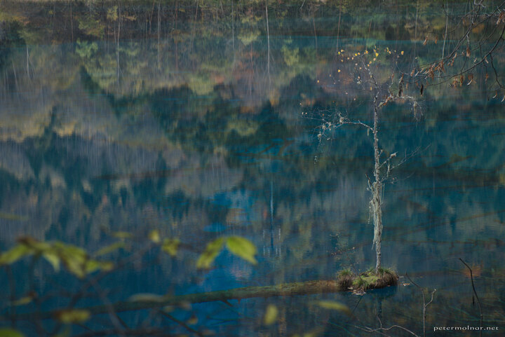

---
author:
    email: mail@petermolnar.net
    image: https://petermolnar.net/favicon.jpg
    name: Peter Molnar
    url: https://petermolnar.net
coordinates:
    latitude: 33.145564
    longitude: 103.870797
copies:
- https://www.flickr.com/photos/36003160@N08/15544554029
- http://web.archive.org/web/20141129213420/https://petermolnar.eu/photo/jiuzhaigou-multicoloured-lake/
published: '2014-10-26T10:15:37+00:00'
syndicate:
- https://brid.gy/publish/flickr
tags:
- Jiuzhaigou Valley
- China
- autumn
- lake
- Sichuan
title: 'Jiuzhaigou: Multicoloured Lake'

---

Taken at the Multicoloured Lake of Jiuzhaigou Valley China, lake,
Jiuzhaigou Valley (九寨沟), Sichuan, autumn; with all the reflections of
the autumn colours, the blues of the water, the small tree on the tiny
island on top of a dead, underwater tree it is a place where you could
spend days, just wondering around.