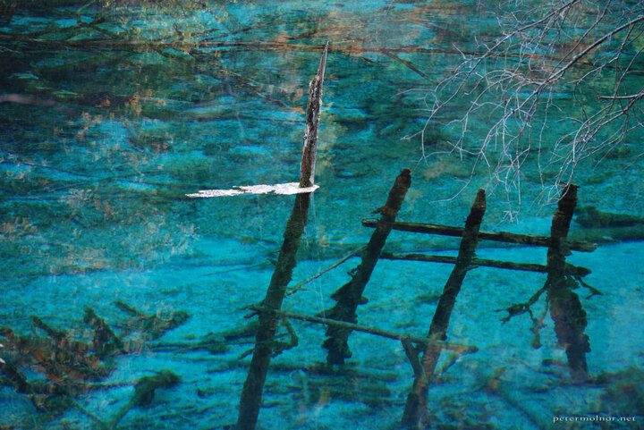

---
author:
    email: mail@petermolnar.net
    image: https://petermolnar.net/favicon.jpg
    name: Peter Molnar
    url: https://petermolnar.net
coordinates:
    latitude: 33.159702
    longitude: 103.875775
copies:
- https://www.flickr.com/photos/36003160@N08/15723174415
- http://web.archive.org/web/20141129055035/https://petermolnar.eu/photo/jiuzhaigou-peacock-riverbed/
published: '2014-10-26T10:35:28+00:00'
syndicate:
- https://brid.gy/publish/flickr
tags:
- Sichuan
- blue
- autumn
- Jiuzhaigou Valley
- lake
- dead trees
- China
title: 'Jiuzhaigou: Peacock Riverbed'

---

Peacock Riverbed is a part of the Five Flowers Lake of Jiuzhaigou Valley
(九寨沟). It has lots of dead trees in deep, rich green-blue water,
which changes hue when you're walking around it.