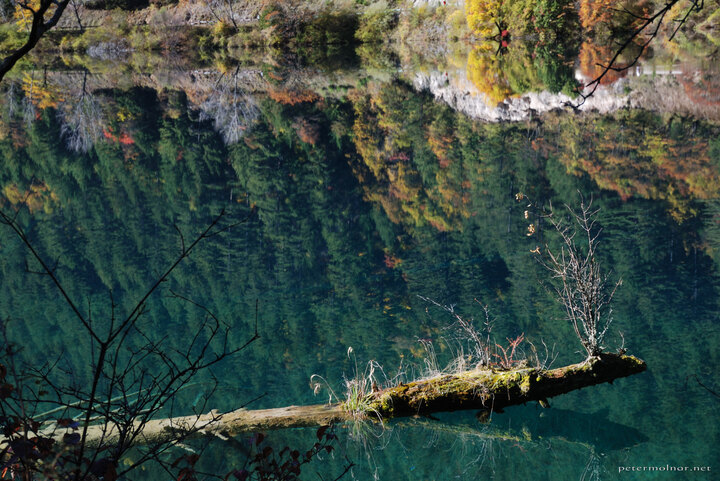

---
author:
    email: mail@petermolnar.net
    image: https://petermolnar.net/favicon.jpg
    name: Peter Molnar
    url: https://petermolnar.net
coordinates:
    latitude: 33.2081
    longitude: 103.906803
copies:
- https://www.flickr.com/photos/36003160@N08/15530374847
- http://web.archive.org/web/20141113103001/https://petermolnar.eu/photo/jiuzhaigou-rhinoceros-lake-reflection-2/
published: '2014-10-26T03:10:45+00:00'
syndicate:
- https://brid.gy/publish/flickr
tags:
- Sichuan
- reflections
- Rhinoceros Lake
- autumn
- lake
- Jiuzhaigou Valley
- China
- tree
title: 'Jiuzhaigou: reflections in Rhinoceros lake 2'

---

We spent a day in Jiuzhaigou Valley (九寨沟) in Sichuan, China. After
the first shock of immense amount of tourists at the front gates the
walk path beside the beautiful Rhinoceros lake turned out to be nearly
empty. This reflection was photographed there.