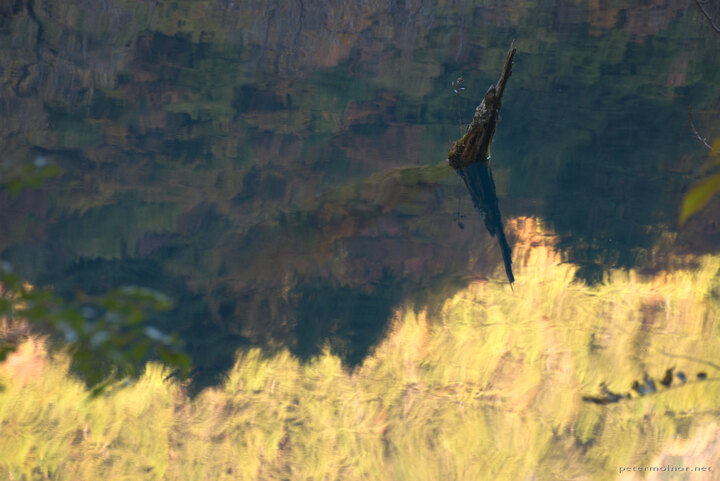

---
author:
    email: mail@petermolnar.net
    image: https://petermolnar.net/favicon.jpg
    name: Peter Molnar
    url: https://petermolnar.net
coordinates:
    latitude: 33.18544
    longitude: 103.894314
copies:
- https://www.flickr.com/photos/36003160@N08/15522317958
- http://web.archive.org/web/20141203141247/https://petermolnar.eu/photo/jiuzhaigou-rhinoceros-lake-reflection/
published: '2014-10-26T02:41:48+00:00'
syndicate:
- https://brid.gy/publish/flickr
tags:
- Sichuan
- reflections
- Rhinoceros Lake
- autumn
- Jiuzhaigou Valley
- lake
- China
title: 'Jiuzhaigou: reflections in Rhinoceros Lake'

---

Taken ad Rhinoceros Lake, in Jiuzhaigou Valley (九寨沟) in Sichuan,
China, At first, even in real life, it was hard to tell reflection from
origin.