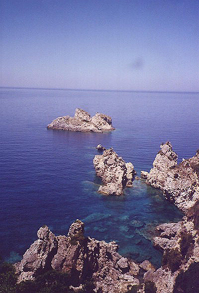

---
author:
    email: mail@petermolnar.net
    image: https://petermolnar.net/favicon.jpg
    name: Peter Molnar
    url: https://petermolnar.net
copies:
- http://web.archive.org/web/20200923080412/https://petermolnar.net/photo/korfu/
published: '2001-06-27T19:40:00+02:00'
tags:
- Corfu
- Greece
- sea
- blue
- rocks
title: Korfu

---

In 2000, we had a family vacation on Corfu. I experienced things never
before: hairdryer-like hot wind in the night, scorging heat from the
pavement in the afternoons, a lot hotter, than the sun itself, gyros as
a starter. It was a good trip, with some spectacular views. Sadly, it
seems like I lost the negative of this picture: I had it in a large
print under a glass on my table for years, and during that process, I
seem to have misplaced the negatives.