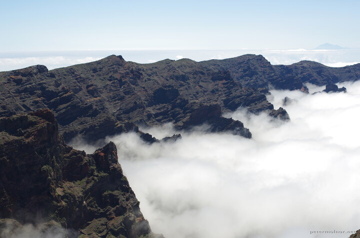

---
author:
    email: mail@petermolnar.net
    image: https://petermolnar.net/favicon.jpg
    name: Peter Molnar
    url: https://petermolnar.net
copies:
- https://www.flickr.com/photos/36003160@N08/40574105910
- http://web.archive.org/web/20190624125718/https://petermolnar.net/la-caldera-de-taburiente/
published: '2018-05-27T10:00:00+00:00'
syndicate:
- https://brid.gy/publish/flickr
tags:
- La Palma
- Canary Islands
- Roque de los Muchachos
- view
title: La Caldera de Taburiente

---

The very top of La Palma is the Roque de los Muchachos with it's 2426m
height. On cloudy days, this is the view - that pointy thing in the
distance is the Teide on Tenerife, way above the clouds, with it's
3718m.