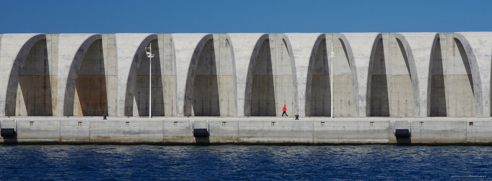

---
author:
    email: mail@petermolnar.net
    image: https://petermolnar.net/favicon.jpg
    name: Peter Molnar
    url: https://petermolnar.net
copies:
- https://www.flickr.com/photos/36003160@N08/35252967853
- http://web.archive.org/web/20190624125720/https://petermolnar.net/la-palma-dock/
published: '2017-07-21T17:00:00+00:00'
syndicate:
- https://brid.gy/publish/flickr
tags:
- La Palma
- concrete
- brutalism
- Canary Islands
- dock
title: The dock of La Palma

---

The best excursions and holidays are the ones where apart from the
planned, you allocate time for the unplanned, our you're willing to
adapt.

We were certainly not planning to go out for whale and dolphin watching,
but when we stopped at a restaurant on top of the cliffs we spotted a
leaflet about Fancy2[^1] and decided to get on it next day.

On our way towards the open sea we passed the surprisingly brutalist
dock; this is what you see on the picture.

[^1]: <http://fancy2.com/fancy-2/>