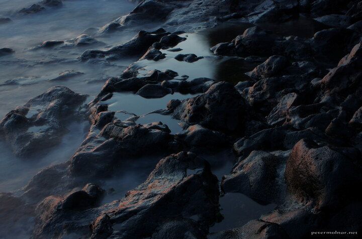

---
author:
    email: mail@petermolnar.net
    image: https://petermolnar.net/favicon.jpg
    name: Peter Molnar
    url: https://petermolnar.net
copies:
- https://www.flickr.com/photos/36003160@N08/36133480101
- http://web.archive.org/web/20190624125721/https://petermolnar.net/la-palma-stones-on-the-shore/
published: '2017-07-31T17:00:00+00:00'
syndicate:
- https://brid.gy/publish/flickr
tags:
- seashore
- La Palma
- longexpo
- Canary Islands
- evening
- stones
title: La Palma - stones on the shore

---

On the first day we arrived to La Palma we only started to look around
and arrived into one of the larger towns rather late. This, however, is
never a problem for photographers: we walked down to the part of the
shore where only one people was fishing - after trying to take cheesy
sunset pictures - and started to experiment with long exposure on the
volcanic rocks.