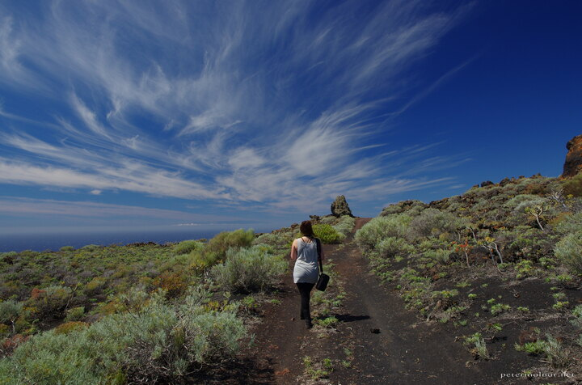

---
author:
    email: mail@petermolnar.net
    image: https://petermolnar.net/favicon.jpg
    name: Peter Molnar
    url: https://petermolnar.net
copies:
- https://www.flickr.com/photos/36003160@N08/36165498106
- http://web.archive.org/web/20190624125724/https://petermolnar.net/la-palma-teneguia-sky/
published: '2017-07-27T17:00:00+00:00'
syndicate:
- https://brid.gy/publish/flickr
tags:
- path
- La Palma
- clouds
- Canary Islands
- sky
- volcanic
- volcano
title: La Palma - Teneguía sky

---

I've seen magnificent skies, but the non-earthy, black volcanic ground,
combined with deep blue sky and beautiful clouds is certainly on the
list of the outerworld-ish experiences.

I did use a polarizer, but I was only trying to capture what my eyes
saw.