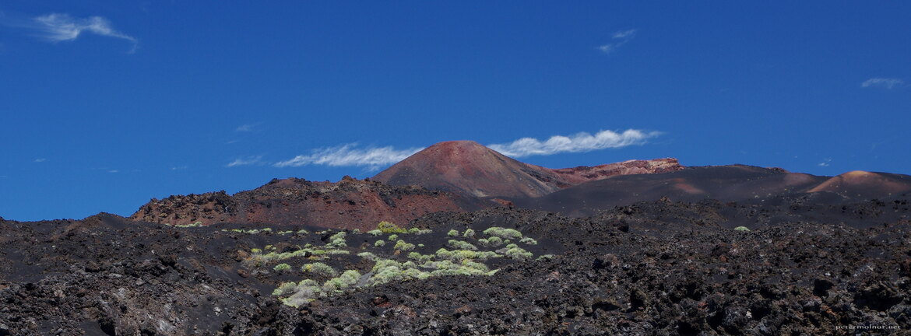

---
author:
    email: mail@petermolnar.net
    image: https://petermolnar.net/favicon.jpg
    name: Peter Molnar
    url: https://petermolnar.net
copies:
- https://www.flickr.com/photos/36003160@N08/35432575673
- http://web.archive.org/web/20190624125725/https://petermolnar.net/la-palma-teneguia-volcano/
published: '2017-07-28T17:00:00+00:00'
syndicate:
- https://brid.gy/publish/flickr
tags:
- landscape
- La Palma
- volcano
- Canary Islands
- volcanic
title: La Palma - Teneguía

---

The South-West area of La Palma is the youngest in terms of volcanic
activity; there was a huge erosion in the '70s, which formed the land
the way it is today.

Originally we didn't plan to visit this area for too long, thinking it's
not as interesting as the rest of the island - we were wrong. Not only
there is a traditional salt factory here, there are lots of small
beaches where nobody goes, and the view is magnificent as well.