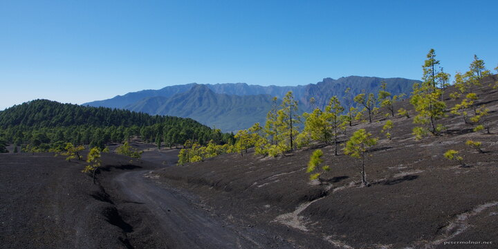

---
author:
    email: mail@petermolnar.net
    image: https://petermolnar.net/favicon.jpg
    name: Peter Molnar
    url: https://petermolnar.net
copies:
- https://www.flickr.com/photos/36003160@N08/35805019660
- http://web.archive.org/web/20190624125726/https://petermolnar.net/la-palma-volcano-route-enrique/
published: '2017-07-26T17:00:00+00:00'
syndicate:
- https://brid.gy/publish/flickr
tags:
- La Palma
- volcano
- Canary Islands
- volcanic
- Enríque
title: La Palma - volcano route next to Enríque

---

Note: always stay 2 additional days at a location than you were
originally planning and don't plan anything for that 2 days. So whatever
you were unaware of, but about learn during your stay, you can check out
on that 2 days.

Unfortunately we didn't do this with our Canary Islands visit, but even
though we were running a little tight on time, the volcano route is not
something you leave out. We drove along on the road that runs more or
less parallel with the route and stopped at a few locations to take a
better look; this is one of them.