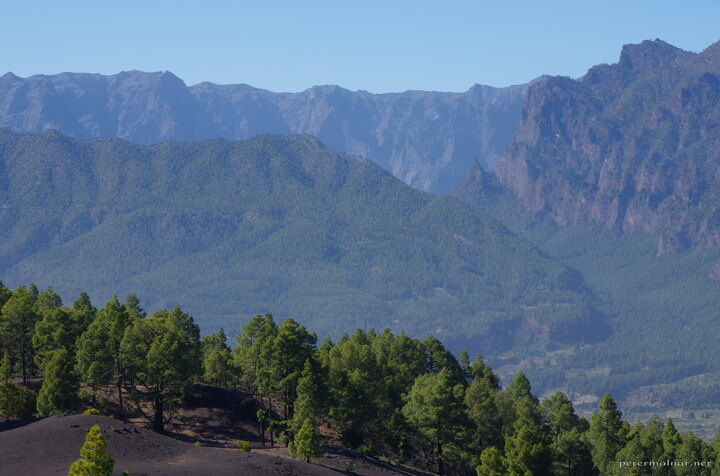

---
author:
    email: mail@petermolnar.net
    image: https://petermolnar.net/favicon.jpg
    name: Peter Molnar
    url: https://petermolnar.net
copies:
- https://www.flickr.com/photos/36003160@N08/36029781722
- http://web.archive.org/web/20190624125728/https://petermolnar.net/la-palma-volcano-route-view/
published: '2017-07-25T17:00:00+00:00'
syndicate:
- https://brid.gy/publish/flickr
tags:
- landscape
- La Palma
- forest
- Canary Islands
- pine
- volcanic
- volcano
title: La Palma - view on the volcano route

---

There is a footpath on La Palma which takes you through the moon-like
landscape of volcanos - the only problem with it is that with all the
black rocks, it can get very hot there. This is a view from the South
towards North.