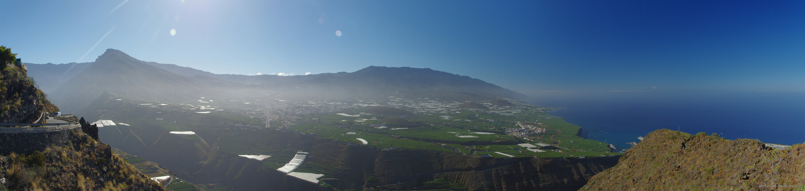

---
author:
    email: mail@petermolnar.net
    image: https://petermolnar.net/favicon.jpg
    name: Peter Molnar
    url: https://petermolnar.net
copies:
- https://www.flickr.com/photos/36003160@N08/36267542705
- http://web.archive.org/web/20190624125729/https://petermolnar.net/la-palma/
published: '2017-07-29T17:00:00+00:00'
syndicate:
- https://brid.gy/publish/flickr
tags:
- La Palma
- panorama
- Canary Islands
- view
title: La Palma - panorama

---

I barely ever had any GPS reception on La Palma so it's a little hard to
tell where exactly the pictures were taken - pictures indeed, because
this is a panorama stitched together from 3 handheld images from a DSLR
by Hugin[^1]. I'm extremely impressed by that software: the 3 source
photos were with different exposure, even their white balance differed a
little yet Hugin put them together without a glitch.

[^1]: <http://hugin.sourceforge.net/>