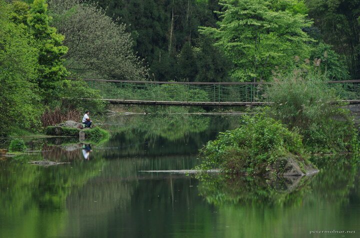

---
author:
    email: mail@petermolnar.net
    image: https://petermolnar.net/favicon.jpg
    name: Peter Molnar
    url: https://petermolnar.net
coordinates:
    latitude: 29.5748670000722
    longitude: 103.395381
copies:
- https://www.flickr.com/photos/36003160@N08/27955216165
- http://web.archive.org/web/20160709135037/https://petermolnar.eu/lake-before-wuxian/
published: '2016-04-09T15:35:21+00:00'
syndicate:
- https://brid.gy/publish/flickr
tags:
- People's Republic of China
- Sichuan
- pond
- green
- fisher
- Mount Emei
- fishing
- lake
- China
- surface
- Emei
- reflection
title: Lake before Wuxian

---

Just before we reached the end of our 2 days descent of endless stairs
of Mount Emei, we reached a lake before the Wuxian car park: it had a
surreal, still surface, with incredible, dream-like reflections.