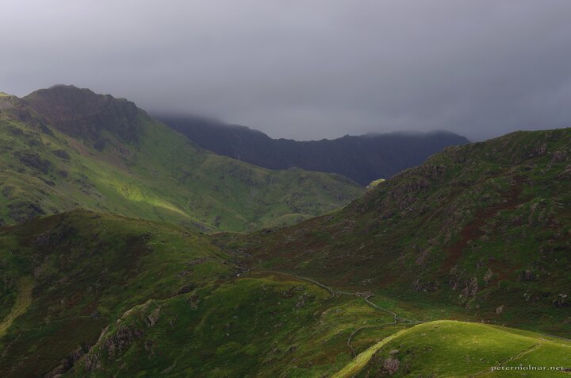

---
author:
    email: mail@petermolnar.net
    image: https://petermolnar.net/favicon.jpg
    name: Peter Molnar
    url: https://petermolnar.net
copies:
- https://www.flickr.com/photos/36003160@N08/51149946991
- http://web.archive.org/web/20210501083722/https://petermolnar.net/photo/landscape-in-wales/
published: '2021-05-01T09:00:00+01:00'
title: Landscape in Wales

---

This photo is from last year, when the UK rules were relaxed enough to
allow some domestic travel, and we went to Snowdonia. We've been there
quite a few times, and while we enjoyed it after months of lockdown, the
weather was far, from gentle. This doesn't change the fact that the
landscape is still fantastic.