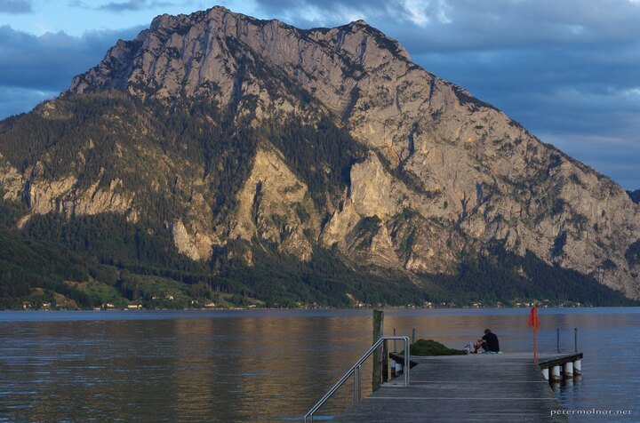

---
author:
    email: mail@petermolnar.net
    image: https://petermolnar.net/favicon.jpg
    name: Peter Molnar
    url: https://petermolnar.net
coordinates:
    latitude: 47.901806
    longitude: 13.769316
copies:
- https://www.flickr.com/photos/36003160@N08/21442466828
- http://web.archive.org/web/20190624125732/https://petermolnar.net/last-light/
published: '2015-09-22T16:18:24+00:00'
syndicate:
- https://brid.gy/publish/flickr
tags:
- Altmünster
- sunset
- golden hour
- mountain
- clouds
- lake
- Austria
title: Last light

---

While sun is setting, this is a usual scene around Altmünster. However,
the clouds at the back helped to add to the drama.