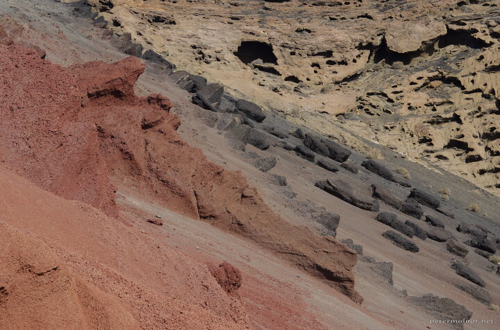

---
author:
    email: mail@petermolnar.net
    image: https://petermolnar.net/favicon.jpg
    name: Peter Molnar
    url: https://petermolnar.net
copies:
- https://www.flickr.com/photos/36003160@N08/39129115161
- http://web.archive.org/web/20190624125734/https://petermolnar.net/layers-of-volcanic-ash/
published: '2017-12-17T08:00:00+00:00'
syndicate:
- https://brid.gy/publish/flickr
tags:
- Canary Islands
- Lanzarote
- volcano
- vulcanic
- vulcano
title: Layers of volcanic ash

---

Lanzarote has a unique lake: it's completely green, called El Lago
Verde. The colour is due to the different volcanic ash falling into the
small lake: all these magnificent slopes around it are contributing to
creating that green water.