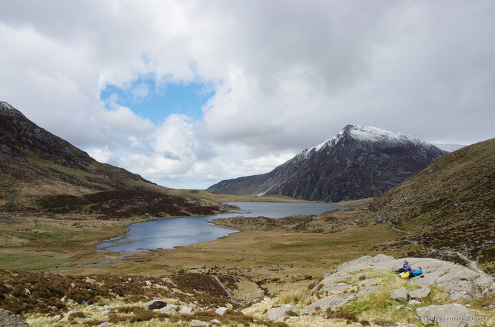

---
author:
    email: mail@petermolnar.net
    image: https://petermolnar.net/favicon.jpg
    name: Peter Molnar
    url: https://petermolnar.net
coordinates:
    latitude: 53.115782
    longitude: -4.028635
copies:
- https://www.flickr.com/photos/36003160@N08/28939019366
- http://web.archive.org/web/20170212140853/https://petermolnar.net/llyn-idwal-from-the-other-side-of-the-lake/
published: '2016-07-30T09:00:15+00:00'
syndicate:
- https://brid.gy/publish/flickr
tags:
- Llyn Idwal
- winter
- spring
- cloudy
- Snowdonia
- mountain
- clouds
- lake
- mountains
- snow
- Wales
- water
title: Llyn Idwal 1

---

The perfect weather is never only bright sunshine. For us, here, it was
some remnants of snow on the top, occasional clouds with the mix of
sunshine and a reasonable temperature to walk around. That is the
perfect weather.