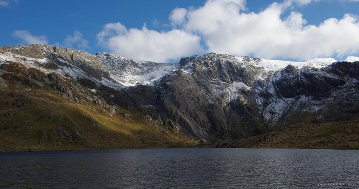

---
author:
    email: mail@petermolnar.net
    image: https://petermolnar.net/favicon.jpg
    name: Peter Molnar
    url: https://petermolnar.net
coordinates:
    latitude: 53.115584
    longitude: -4.030248
copies:
- https://www.flickr.com/photos/36003160@N08/27871768923
- http://web.archive.org/web/20170212005958/https://petermolnar.net/llyn-idwal/
published: '2016-07-23T09:00:23+00:00'
syndicate:
- https://brid.gy/publish/flickr
tags:
- Llyn Idwal
- winter
- spring
- cloudy
- Snowdonia
- mountain
- clouds
- lake
- mountains
- snow
- Wales
- water
title: Llyn Idwal

---

One can always wish for the perfect weather, yet most of the times, it
remains a wish. Not this time.

There is a National Trust recommendation to visit Llyn Idwal, which
Nora[^1] spotted, and they were right about the place: it's magnificent.
We really weren't expecting snow on the mountains in May, but that,
combined with the clouds and the late afternoon sunshine was just
perfect.

I cropped the image, but apart from that, it really looked like this. No
edits, no nothing.

[^1]: <https://norahamucska.eu>