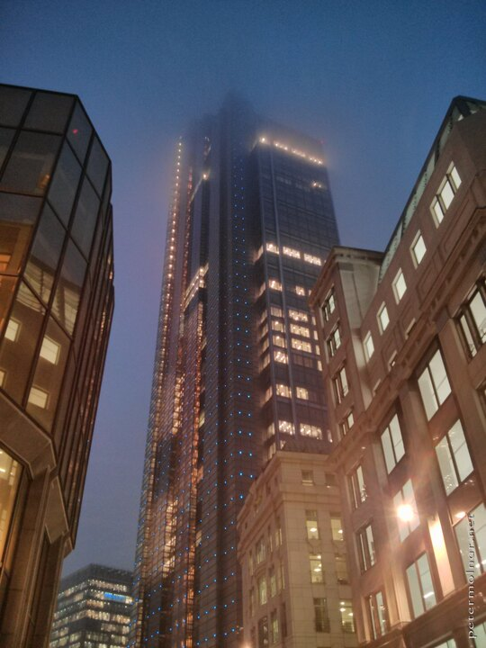

---
author:
    email: mail@petermolnar.net
    image: https://petermolnar.net/favicon.jpg
    name: Peter Molnar
    url: https://petermolnar.net
coordinates:
    latitude: 51.516527000125
    longitude: -0.081217
copies:
- https://www.flickr.com/photos/36003160@N08/14625288198
- https://www.flickr.com/photos/petermolnareu/46281172064/
- http://web.archive.org/web/20190624125753/https://petermolnar.net/london-at-night-heron-tower/
published: '2014-08-02T20:00:33+00:00'
syndicate:
- https://brid.gy/publish/flickr
tags:
- skyscraper
- night
- London
- Heron Tower
title: London at night - Heron Tower

---

I've worked a few month in the City of London; some of the buildings you
see during the day become very different during the night.