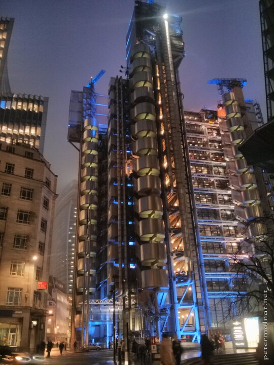

---
author:
    email: mail@petermolnar.net
    image: https://petermolnar.net/favicon.jpg
    name: Peter Molnar
    url: https://petermolnar.net
coordinates:
    latitude: 51.513142
    longitude: -0.0823970001277778
copies:
- https://www.flickr.com/photos/36003160@N08/14817874141
- http://web.archive.org/web/20140919080706/https://petermolnar.eu/photo/london-at-night-lloyds-building/
published: '2014-08-03T20:00:26+00:00'
syndicate:
- https://brid.gy/publish/flickr
tags:
- cyberpunk
- 80s
- London
- LLoyd's Building
- sci-fi
- night
title: London at night - Lloyd's Building

---

I'm in love with the Lloyd's Building[^1], especially with the night
lights on. It immediately puts you in an 80s cyberpunk movie.

[^1]: <https://en.wikipedia.org/wiki/Lloyd's_building>