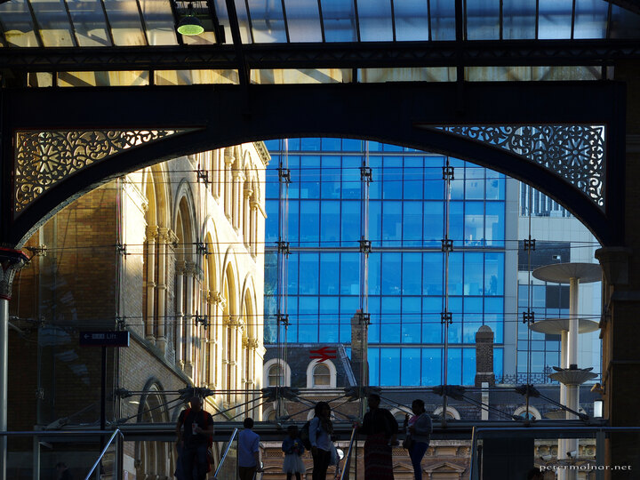

---
author:
    email: mail@petermolnar.net
    image: https://petermolnar.net/favicon.jpg
    name: Peter Molnar
    url: https://petermolnar.net
coordinates:
    latitude: 51.517495
    longitude: -0.081828
copies:
- https://www.flickr.com/photos/36003160@N08/22061618171
- http://web.archive.org/web/20190624125757/https://petermolnar.net/london-colours/
published: '2015-10-09T11:05:33+00:00'
syndicate:
- https://brid.gy/publish/flickr
tags:
- glass
- Liverpool Street Station
- window
- London
- reflection
title: London Colours

---

I've worked close to this station; used it basically every weekday in
the morning and in the afternoon for 9 months, and I've never seen these
colours before.

London is beautiful at the end of September.