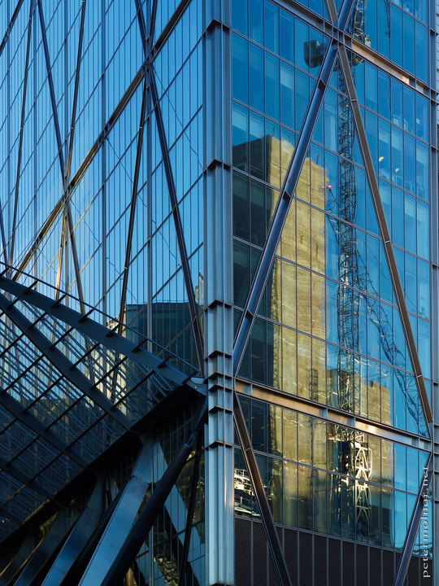

---
author:
    email: mail@petermolnar.net
    image: https://petermolnar.net/favicon.jpg
    name: Peter Molnar
    url: https://petermolnar.net
coordinates:
    latitude: 51.520059
    longitude: -0.078996
copies:
- https://www.flickr.com/photos/36003160@N08/21796872312
- http://web.archive.org/web/20190624125758/https://petermolnar.net/london-illusions/
published: '2015-09-29T11:33:04+00:00'
syndicate:
- https://brid.gy/publish/flickr
tags:
- crane
- glass
- London
- building
- construction
- skyscraper
- reflection
title: London Illusions

---

London is the city of illusions; the city that keeps telling you
everything is possible, even if your time and resources are pretty
limited for that everything. It's just like the reflection of that
construction, which takes way too long and will most probably be another
fancy office instead of flats, which the UK is in a terrible need of.