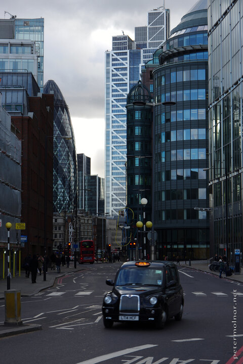

---
author:
    email: mail@petermolnar.net
    image: https://petermolnar.net/favicon.jpg
    name: Peter Molnar
    url: https://petermolnar.net
coordinates:
    latitude: 51.519585
    longitude: -0.079146
copies:
- https://www.flickr.com/photos/36003160@N08/15509218033
- http://web.archive.org/web/20150502222034/https://petermolnar.eu/photo/london-liverpool-street/
published: '2014-12-28T15:42:04+00:00'
syndicate:
- https://brid.gy/publish/flickr
tags:
- Liverpool Street
- cab
- England
- London
- Heron Tower
title: London, Liverpool Street

---

I had a day out in London, visiting a few markets around Spitalfields.
When I headed back to the station the sun came out for a few moments
from the clouds and the street was nearly abandoned.