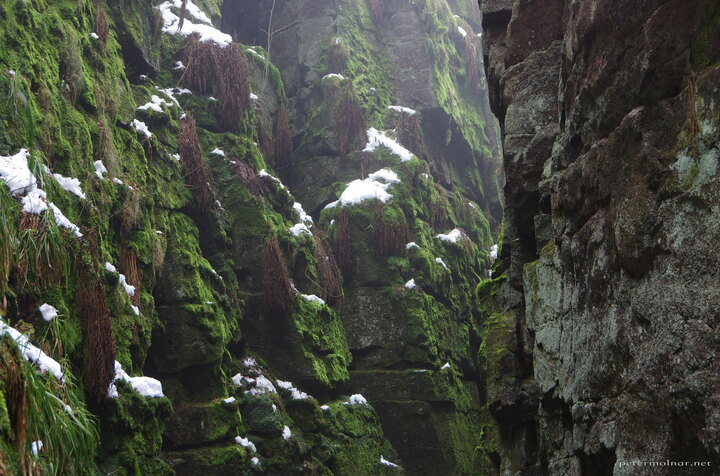

---
author:
    email: mail@petermolnar.net
    image: https://petermolnar.net/favicon.jpg
    name: Peter Molnar
    url: https://petermolnar.net
coordinates:
    latitude: 53.188293
    longitude: -2.021741
copies:
- https://www.flickr.com/photos/36003160@N08/16740064901
- http://web.archive.org/web/20150503041710/https://petermolnar.eu/photo/luds-church-edges/
published: '2015-03-07T11:18:08+00:00'
syndicate:
- https://brid.gy/publish/flickr
tags:
- winter
- United Kingdom
- Peak District
- moss
- Lud's Church
- fern
- snow
- stones
- stone
title: Lud's Church - Edges

---

Lud's Church is an astonishingly beautiful chasm in the Peak District.

You have two paths to choose from to visit it and from one of these the
place is literally a hole in the ground. I'm glad we choose the other
path.

The place itself is similar to Puzzlewood, yet smaller in area while
much larger in height.

When we visited this probably was the only spot in the whole of England
where there was a fog and a chill. During our drive from Cambridge the
sun was shining, the weather was mild - until we reached the Peak
District, but hey! It was supposed to be winter anyway.