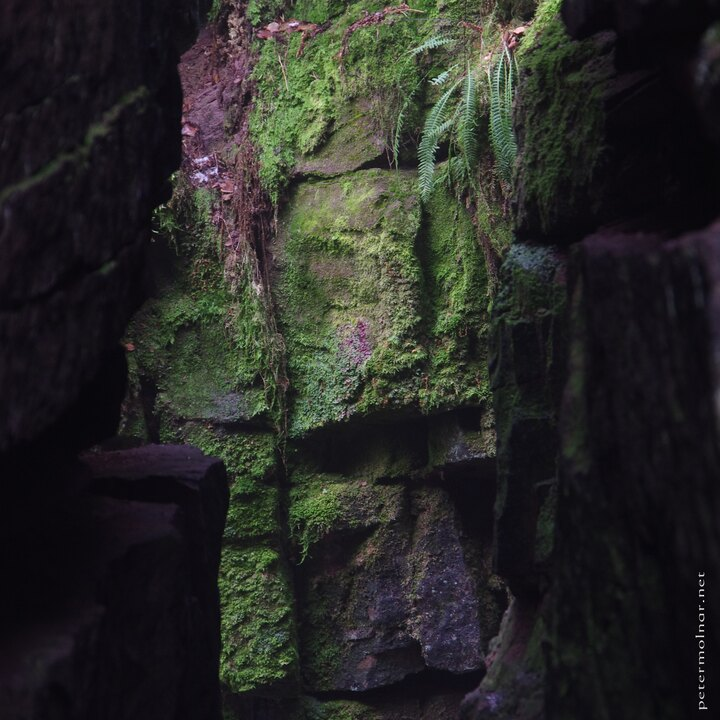

---
author:
    email: mail@petermolnar.net
    image: https://petermolnar.net/favicon.jpg
    name: Peter Molnar
    url: https://petermolnar.net
coordinates:
    latitude: 53.18963
    longitude: -2.02672
copies:
- https://www.flickr.com/photos/36003160@N08/16128626944
- http://web.archive.org/web/20150502220912/https://petermolnar.eu/photo/luds-church-rectangulars/
published: '2015-03-08T09:03:01+00:00'
syndicate:
- https://brid.gy/publish/flickr
tags:
- winter
- United Kingdom
- Lud's Church
- moss
- Peak District
- stones
- stone
title: Lud's Church - Rectangulars

---

Lud's Church is an astonishingly beautiful chasm in the Peak District.

You have two paths to choose from to visit it and from one of these the
place is literally a hole in the ground. I'm glad we choose the other
path.

The place itself is similar to Puzzlewood, yet smaller in area while
much larger in height.