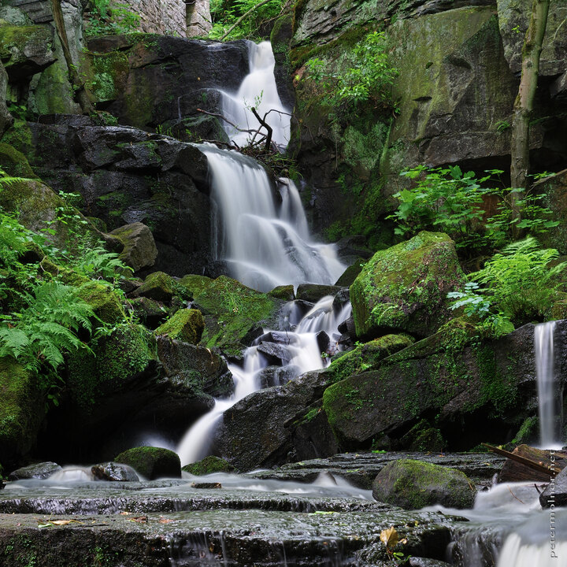

---
author:
    email: mail@petermolnar.net
    image: https://petermolnar.net/favicon.jpg
    name: Peter Molnar
    url: https://petermolnar.net
coordinates:
    latitude: 53.141248
    longitude: -1.534094
copies:
- https://www.flickr.com/photos/36003160@N08/19886108571
- http://web.archive.org/web/20190624125805/https://petermolnar.net/lumsdale-falls/
published: '2015-07-20T00:00:08+00:00'
syndicate:
- https://brid.gy/publish/flickr
tags:
- Bentley Brook
- long exposure
- Lumsdale
- stream
- summer
- forest
- United Kingdom
- Peak District
- waterfall
- Matlock
- water
title: Lumsdale Falls

---

The more time you spend on shooting a picture from the same spot the
less chance of a good image you'll end up with. Try to plan it first,
imagine it in your head and don't make unneeded shoots, like I did when
I tried to frame the waterfall.