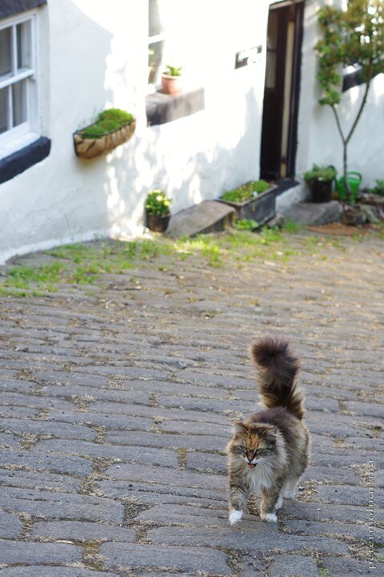

---
author:
    email: mail@petermolnar.net
    image: https://petermolnar.net/favicon.jpg
    name: Peter Molnar
    url: https://petermolnar.net
coordinates:
    latitude: 53.121796
    longitude: -1.563255
copies:
- https://www.flickr.com/photos/36003160@N08/19773141701
- http://web.archive.org/web/20190624125811/https://petermolnar.net/matlock-cat/
published: '2015-07-17T09:00:59+00:00'
syndicate:
- https://brid.gy/publish/flickr
tags:
- England
- summer
- United Kingdom
- Peak District
- Matlock Bath
- cat
- alley
title: Matlock cat

---

A horrible habit of ours with my wife what in case we spot a sympathetic
animal we try to touch it. In this case there was no need for any
tricks, the cat walked right up to us and certainly tried to bewitch us
to take her home.

Being 200 miles from our flat and having a pretty territorial male cat
made us leave her behind unfortunately.