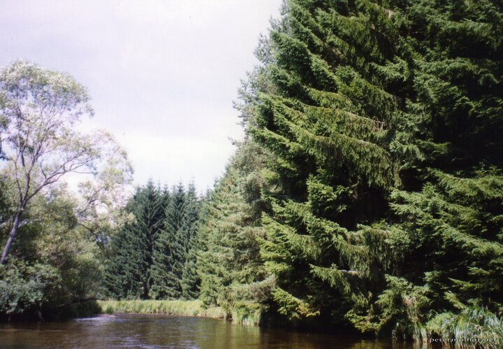

---
author:
    email: mail@petermolnar.net
    image: https://petermolnar.net/favicon.jpg
    name: Peter Molnar
    url: https://petermolnar.net
copies:
- http://web.archive.org/web/20200923080414/https://petermolnar.net/photo/moldva/
published: '2003-09-01T09:00:00+02:00'
tags:
- Czech Republic
- Sumava
title: Moldva

---

In the early 2000s my family joined some canuing trips organized by the
Bohemia Baráti Kör. Every odd year, the trip was on the Moldva, every
even, on some smaller rivers. The Sumava part of the Moldva, just after
it's source, is under heavy protection, and for roughly 20km, you aren't
even allowed to moor, just on one of the sides of the river.

I didn't yet have any proper gear back then; this is on cheap,
commercial film, with an analogue camera, that got soaked a few times
during canue trips, and misfocused a lot as a result.