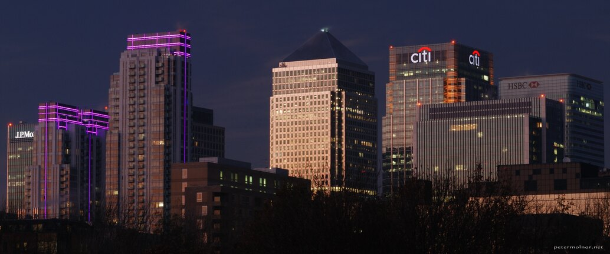

---
author:
    email: mail@petermolnar.net
    image: https://petermolnar.net/favicon.jpg
    name: Peter Molnar
    url: https://petermolnar.net
coordinates:
    latitude: 51.492212
    longitude: -0.010632
copies:
- https://www.flickr.com/photos/36003160@N08/22117436818
- http://web.archive.org/web/20190624125825/https://petermolnar.net/money-capital/
published: '2015-10-19T14:23:54+00:00'
syndicate:
- https://brid.gy/publish/flickr
tags:
- Canary Wharf
- purple
- sunset
- lights
- Mudchute Farm
- Isle of Dogs
- London
- architecture
title: Money Capital

---

London has some interesting features.

One of them is the situation when the sun is still up, you're standing
at Mudchute Farm, literally next to a pig, looking at Canary Wharf, with
lights on already.

(And no, this was not edited, this was the actual view.)