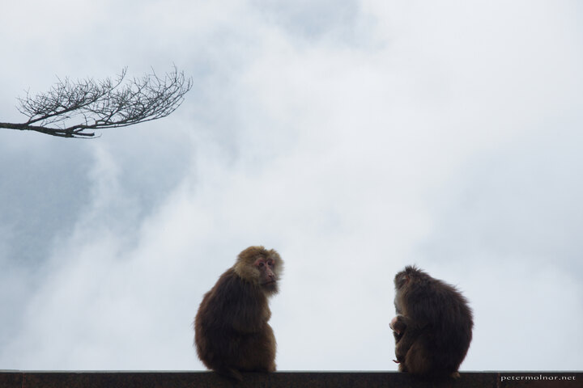

---
author:
    email: mail@petermolnar.net
    image: https://petermolnar.net/favicon.jpg
    name: Peter Molnar
    url: https://petermolnar.net
coordinates:
    latitude: 29.557458
    longitude: 103.343858
copies:
- https://www.flickr.com/photos/36003160@N08/28070747771
- http://web.archive.org/web/20190624125832/https://petermolnar.net/monkeys-of-nothingness-2/
published: '2016-07-07T08:00:15+00:00'
syndicate:
- https://brid.gy/publish/flickr
tags:
- silhouette
- People's Republic of China
- monkey
- empty
- monkeys
- Mount Emei
- void
- stare
- Tibetan macaque
- nothing
- China
- tree
- cloud
title: Monkeys of nothingness 2

---

I love prime lens. They are small, sharp, and by removing a step to
think about - no zoom - they let you think more of that actually is
going to be in the picture. ( Although this may not be true in general,
only in my case. )

But primes can become serious restraints when you encounter the
unexpected. In this case, a monastery, sitting within the clouds, with
families of monkeys admiring the astonishing nothingness.

It takes too long to switch to the zoom lens, or to switch to another
prime, which will eventually lead to missed moments. In my case, a
perfect image of a monkey drinking from a bottle, with a reflection of
it in a pool of water. By the time I switched to a longer lens, that
moment was gone.

I still had the chance to create this one, which I'm quite glad for; but
the lesson is learnt: when you don't know what to expect, keep the zoom
lens on.