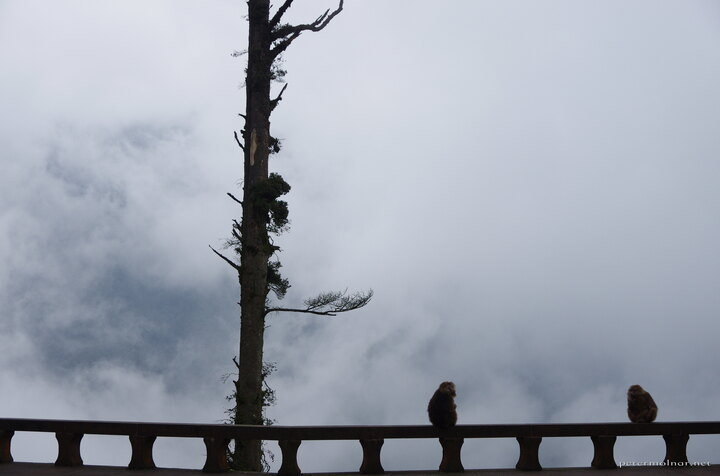

---
author:
    email: mail@petermolnar.net
    image: https://petermolnar.net/favicon.jpg
    name: Peter Molnar
    url: https://petermolnar.net
coordinates:
    latitude: 29.557461
    longitude: 103.343981
copies:
- https://www.flickr.com/photos/36003160@N08/27508459924
- http://web.archive.org/web/20160709135539/https://petermolnar.net/monkeys-of-nothingness/
published: '2016-07-06T08:00:12+00:00'
syndicate:
- https://brid.gy/publish/flickr
tags:
- Elephant Bathing Pool
- Sichuan
- monkey
- Xixiangchi
- Tibetan Macaque
- fog
- Mount Emei
- mist
- Macaque
- China
- mystical
- Emei
title: Monkeys of nothingness

---

There are moments in your life which you never expect, never anticipate
to see. Even if you've seen countless brilliant photographs or numerous
magnificent movies of nature, you don't expect to see a Buddhist temple,
with a monkey family, buried in the clouds, where the monkey sit on the
railing so watch the nothingness of the passing fog.