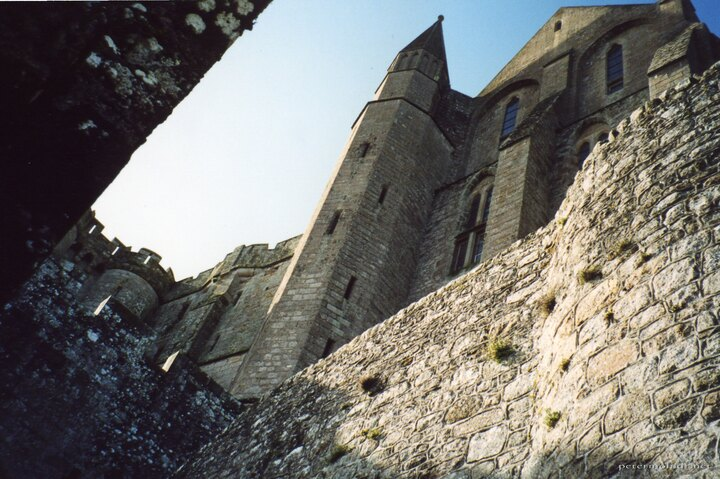

---
author:
    email: mail@petermolnar.net
    image: https://petermolnar.net/favicon.jpg
    name: Peter Molnar
    url: https://petermolnar.net
copies:
- http://web.archive.org/web/20200923080416/https://petermolnar.net/photo/montstmichel-alulrol/
published: '2002-04-01T09:00:00+01:00'
tags:
- France
- Mont St Michel
title: Mont St Michel alulról

---

If I'm not mistaken, this was in 2002. My high school brought a rock
opera to stage - István, a király -, all live: musicians, choire,
dancers, everything. At that time, I was tech support behind the
production. Somehow the school successfully applied for grants to take
the production to France under the Year of Hungarian Culture banner. One
day we got asked to choose which place we wish to visit: Mont St Michel
or the beach of D-Day. To be honest, I had absolutely no idea what Mont
St Michel was; what I did know, is that there's a Mike Oldfield song
with the same title, on one of my all-time favourite albums,
[Voyager](https://en.wikipedia.org/wiki/Voyager_(Mike_Oldfield_album)).
Without even waiting for them to describe what this was, I jumped on the
bus for this destination - this action proven to be beneficial, given a
lot more wanted to do this trip. I mean ... rock opera, plus the years
of the LOtR movie releases; everyone was into fantasy from the group.

Mont St Michel is absolutely gorgeous. I wish I'll have the chance to
revisit it sometimes in the future.