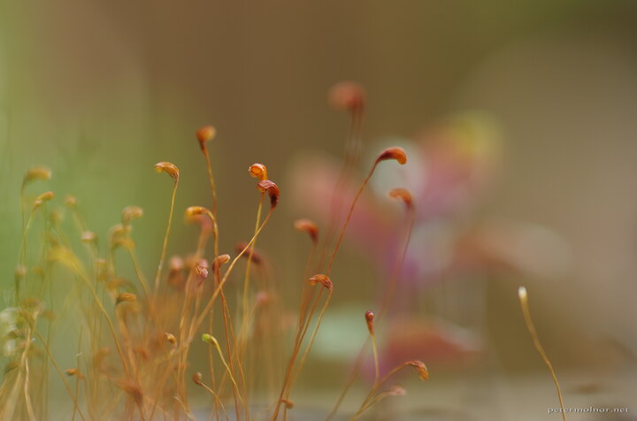

---
author:
    email: mail@petermolnar.net
    image: https://petermolnar.net/favicon.jpg
    name: Peter Molnar
    url: https://petermolnar.net
copies:
- https://www.flickr.com/photos/36003160@N08/18480055832
- http://web.archive.org/web/20190624125835/https://petermolnar.net/moss/
published: '2014-08-15T12:02:10+00:00'
syndicate:
- https://brid.gy/publish/flickr
tags:
- moss
- closeup
- colours
- macro
- colors
title: Moss

---

We had some moss growing in the same pot the red mint is living in, so I
took a few shoots. The colourful spots in the background is the mint
itself.

Shoot with an 50mm 1.8 + Raynox DCR 250.